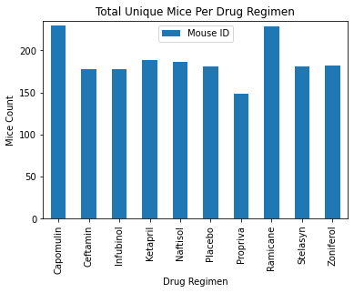
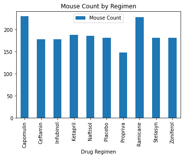
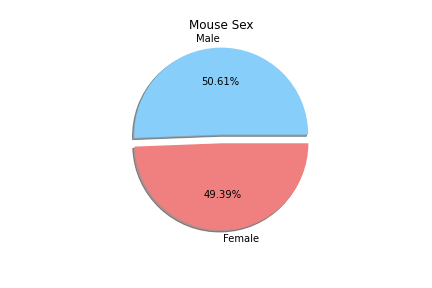
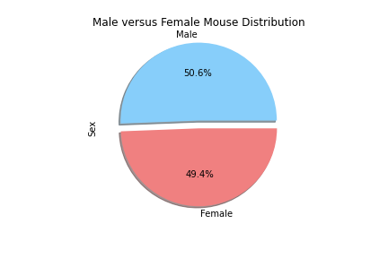
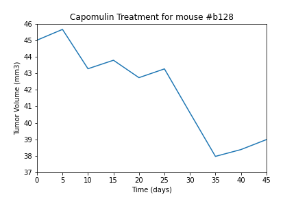
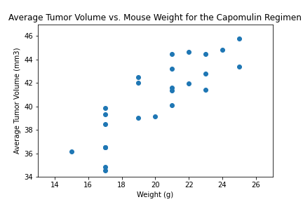
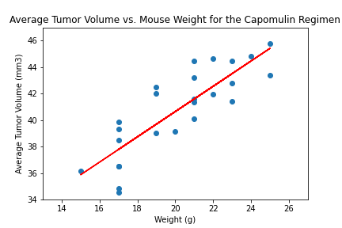

# The Power of Plots

## Background


While your data companions rushed off to jobs in finance and government, you remained adamant that science was the way for you. Staying true to your mission, you've joined Pymaceuticals Inc., a burgeoning pharmaceutical company based out of San Diego. Pymaceuticals specializes in anti-cancer pharmaceuticals. In its most recent efforts, it began screening for potential treatments for squamous cell carcinoma (SCC), a commonly occurring form of skin cancer.

As a senior data analyst at the company, you've been given access to the complete data from their most recent animal study. In this study, 249 mice identified with SCC tumor growth were treated through a variety of drug regimens. Over the course of 45 days, tumor development was observed and measured. The purpose of this study was to compare the performance of Pymaceuticals' drug of interest, Capomulin, versus the other treatment regimens. You have been tasked by the executive team to generate all of the tables and figures needed for the technical report of the study. The executive team also has asked for a top-level summary of the study results.

## My Data Results

Before beginning the analysis, check the data for any mouse ID with duplicate time points and remove any data associated with that mouse ID.

```python
#get duplicate mice by Mouse ID and Timepoint
duplicateMice_df = merge_df[merge_df.duplicated(["Mouse ID", "Timepoint"])]
duplicateMice_df
```

```python
#Get all the data for the duplicate mouse ID
merge_df.loc[merge_df["Mouse ID"] == "g989"]
```
<div>
<table border=\"1\" class=\"dataframe\">
         <thead>
           <tr style=\"text-align: right;\">
             <th></th>
             <th>Mouse ID</th>
             <th>Drug Regimen</th>
             <th>Sex</th>
             <th>Age_months</th>
             <th>Weight (g)</th>
             <th>Timepoint</th>
             <th>Tumor Volume (mm3)</th>
             <th>Metastatic Sites</th>
           </tr>
         </thead>
         <tbody>
           <tr>
             <th>908</th>
             <td>g989</td>
             <td>Propriva</td>
             <td>Female</td>
             <td>21</td>
             <td>26</td>
             <td>0</td>
             <td>45.000000</td>
             <td>0</td>
           </tr>
           <tr>
             <th>909</th>
             <td>g989</td>
             <td>Propriva</td>
             <td>Female</td>
             <td>21</td>
             <td>26</td>
             <td>0</td>
             <td>45.000000</td>
             <td>0</td>
           </tr>
           <tr>
             <th>910</th>
             <td>g989</td>
             <td>Propriva</td>
             <td>Female</td>
             <td>21</td>
             <td>26</td>
             <td>5</td>
             <td>48.786801</td>
             <td>0</td>
           </tr>
           <tr>
             <th>911</th>
             <td>g989</td>
             <td>Propriva</td>
             <td>Female</td>
             <td>21</td>
             <td>26</td>
             <td>5</td>
             <td>47.570392</td>
             <td>0</td>
           </tr>
           <tr>
             <th>912</th>
             <td>g989</td>
             <td>Propriva</td>
             <td>Female</td>
             <td>21</td>
             <td>26</td>
             <td>10</td>
             <td>51.745156</td>
             <td>0</td>
           </tr>
           <tr>
             <th>913</th>
             <td>g989</td>
             <td>Propriva</td>
             <td>Female</td>
             <td>21</td>
             <td>26</td>
             <td>10</td>
             <td>49.880528</td>
             <td>0</td>
           </tr>
           <tr>
             <th>914</th>
             <td>g989</td>
             <td>Propriva</td>
             <td>Female</td>
             <td>21</td>
             <td>26</td>
             <td>15</td>
              <td>51.325852</td>
             <td>1</td>
           </tr>
           <tr>
             <th>915</th>
             <td>g989</td>
             <td>Propriva</td>
             <td>Female</td>
             <td>21</td>
             <td>26</td>
             <td>15</td>
             <td>53.442020</td>
             <td>0</td>
           </tr>
           <tr>
             <th>916</th>
             <td>g989</td>
             <td>Propriva</td>
             <td>Female</td>
             <td>21</td>
             <td>26</td>
             <td>20</td>
             <td>55.326122</td>
             <td>1</td>
           </tr>
           <tr>
             <th>917</th>
             <td>g989</td>
             <td>Propriva</td>
             <td>Female</td>
             <td>21</td>
             <td>26</td>
             <td>20</td>
             <td>54.657650</td>
             <td>1</td>
           </tr>
           <tr>
             <th>918</th>
             <td>g989</td>
             <td>Propriva</td>
             <td>Female</td>
             <td>21</td>
             <td>26</td>
             <td>25</td>
             <td>56.045564</td>
             <td>1</td>
           </tr>
           <tr>
             <th>919</th>
             <td>g989</td>
             <td>Propriva</td>
             <td>Female</td>
             <td>21</td>
             <td>26</td>
             <td>30</td>
             <td>59.082294</td>
             <td>1</td>
           </tr>
           <tr>
             <th>920</th>
             <td>g989</td>
             <td>Propriva</td>
             <td>Female</td>
             <td>21</td>
             <td>26</td>
             <td>35</td>
             <td>62.570880</td>
             <td>2</td>
           </tr>
         </tbody>
       </table>
       </div>

* Generate a summary statistics table consisting of the mean, median, variance, standard deviation, and SEM of the tumor volume for each drug regimen.
```python
#Summary statistics of tumor volume
drug_regimen_groupby = de_dup_df.groupby(["Drug Regimen"])
reg_mean = drug_regimen_groupby["Tumor Volume (mm3)"].mean()
reg_med = drug_regimen_groupby["Tumor Volume (mm3)"].median()
reg_var = drug_regimen_groupby["Tumor Volume (mm3)"].var()
reg_std = drug_regimen_groupby["Tumor Volume (mm3)"].std()
reg_sem = drug_regimen_groupby["Tumor Volume (mm3)"].sem()

summary_stats_df = pd.DataFrame({"Mean": reg_mean.map("{:.2f}".format),
                                 "Median": reg_med.map("{:.2f}".format),
                                 "Variance": reg_var.map("{:.2f}".format),
                                 "Standard Deviation": reg_std.map("{:.2f}".format),
                                 "SEM": reg_sem.map("{:.2f}".format)})
summary_stats_df
```
<div>
<table border=\"1\" class=\"dataframe\">
         <thead>
           <tr style=\"text-align: right;\">
             <th></th>
             <th>Mean</th>
             <th>Median</th>
             <th>Variance</th>
             <th>Standard Deviation</th>
             <th>SEM</th>
           </tr>
           <tr>
             <th>Drug Regimen</th>
             <th></th>
             <th></th>
             <th></th>
             <th></th>
             <th></th>
           </tr>
         </thead>
         <tbody>
           <tr>
             <th>Capomulin</th>
             <td>40.68</td>
             <td>41.56</td>
             <td>24.95</td>
             <td>4.99</td>
             <td>0.33</td>
           </tr>
           <tr>
             <th>Ceftamin</th>
             <td>52.59</td>
             <td>51.78</td>
             <td>39.29</td>
             <td>6.27</td>
             <td>0.47</td>
           </tr>
           <tr>
             <th>Infubinol</th>
             <td>52.88</td>
             <td>51.82</td>
             <td>43.13</td>
             <td>6.57</td>
             <td>0.49</td>
           </tr>
           <tr>
             <th>Ketapril</th>
             <td>55.24</td>
             <td>53.70</td>
             <td>68.55</td>
             <td>8.28</td>
             <td>0.60</td>
           </tr>
           <tr>
             <th>Naftisol</th>
             <td>54.33</td>
             <td>52.51</td>
             <td>66.17</td>
            <td>8.13</td>
             <td>0.60</td>
           </tr>
           <tr>
             <th>Placebo</th>
             <td>54.03</td>
             <td>52.29</td>
             <td>61.17</td>
             <td>7.82</td>
             <td>0.58</td>
           </tr>
           <tr>
             <th>Propriva</th>
             <td>52.32</td>
             <td>50.45</td>
             <td>43.85</td>
             <td>6.62</td>
             <td>0.54</td>
           </tr>
           <tr>
             <th>Ramicane</th>
             <td>40.22</td>
             <td>40.67</td>
             <td>23.49</td>
             <td>4.85</td>
             <td>0.32</td>
           </tr>
           <tr>
             <th>Stelasyn</th>
             <td>54.23</td>
             <td>52.43</td>
             <td>59.45</td>
             <td>7.71</td>
             <td>0.57</td>
           </tr>
           <tr>
             <th>Zoniferol</th>
             <td>53.24</td>
             <td>51.82</td>
             <td>48.53</td>
             <td>6.97</td>
             <td>0.52</td>
           </tr>
         </tbody>
       </table>
       </div>

* Generate a bar plot using both Pandas's `DataFrame.plot()` and Matplotlib's `pyplot` that shows  the number of total mice for each treatment regimen throughout the course of the study.
```python
#Generate a bar plot showing the total number of unique mice tested on each drug regimint
drug_regimen_df = de_dup_df[["Drug Regimen", "Mouse ID"]]
drug_regimen_names = drug_regimen_df.groupby(["Drug Regimen"]).count()
drug_regimen_names.plot(kind="bar")
plt.ylim((0, 235))
plt.title("Total Unique Mice Per Drug Regimen")
plt.xlabel("Drug Regimen")
plt.ylabel("Mice Count")
plt.savefig("Analysis/TotalUniqueMiceBar.png", bbox_inches='tight')
plt.show()
```



```python
#Generate a bar plot showing the total number of unique mice tested on each drug regimint
grp_time = de_dup_df.groupby(['Drug Regimen'])
plot_data = grp_time.agg({'Mouse ID':['count']})

plot_data.columns = ['Mouse Count']
plot_data.plot(kind='bar', title="Mouse Count by Regimen")
plt.savefig("Analysis/TotalUniqueMiceBar2.png", bbox_inches='tight')
```



* Generate a pie plot using both Pandas's `DataFrame.plot()` and Matplotlib's `pyplot` that shows the distribution of female or male mice in the study.
```python
#generate a pie plot showing the distribution of female to male mice using pandas
plt.pie(gender_count, shadow=True, autopct="%1.2f%%", explode=explode, colors=colors, labels=('Male', 'Female'))
plt.title("Mouse Sex")
plt.savefig("Analysis/MalevFemaleDist_pandas.png")
```



```python
#generate a pie plot showing the distribution of female to male mice using pyplot
gender_count = merge_df["Sex"].value_counts()
colors = ["lightskyblue", "lightcoral"]
explode = [0.1, 0]
gender_count.plot(kind="pie", autopct="%1.1f%%", explode=explode, colors=colors, shadow=True)
plt.title("Male versus Female Mouse Distribution")
plt.savefig("Analysis/MalevFemaleDist.png")
plt.show()
```



* Select a mouse that was treated with Capomulin and generate a line plot of tumor volume vs. time point for that mouse.
```python
#generate a line plot of tumor volume vs. timepoint for a mouse treated with Capomulin
mouse_id = "b128"
capo_df = de_dup_df.loc[de_dup_df["Drug Regimen"] == "Capomulin", :]
b128_df = capo_df.loc[capo_df["Mouse ID"] == mouse_id, :]
x_axis = b128_df["Timepoint"]
y_axis = b128_df["Tumor Volume (mm3)"]
plt.plot(x_axis, y_axis)
plt.xlim((0, 46))
plt.ylim((37,46))
plt.title(f"Capomulin Treatment for mouse #{mouse_id}")
plt.xlabel("Time (days)")
plt.ylabel("Tumor Volume (mm3)")
plt.savefig("Analysis/TumorVolumeLine_pyplot.png")
plt.show()
```



* Generate a scatter plot of mouse weight versus average tumor volume for the Capomulin treatment regimen.
```python
# Generate a scatter plot of average tumor volume vs. mouse weight for the Capomulin regimen
capo_average_tumor_vol = capo_df.groupby(["Mouse ID"]).mean()
x_axis = capo_average_tumor_vol["Weight (g)"]
y_axis = capo_average_tumor_vol["Tumor Volume (mm3)"]
plt.scatter(x_axis, y_axis)
plt.xlim((13, 27))
plt.ylim((34, 47))
plt.title("Average Tumor Volume vs. Mouse Weight for the Capomulin Regimen")
plt.xlabel("Weight (g)")
plt.ylabel("Average Tumor Volume (mm3)")
plt.savefig("Analysis/TumorVolumeScatter_pyplot.png")
plt.show()
```



* Calculate the correlation coefficient and linear regression model between mouse weight and average tumor volume for the Capomulin treatment. Plot the linear regression model on top of the previous scatter plot.
```python
# Calculate the correlation coefficient and linear regression model 
# for mouse weight and average tumor volume for the Capomulin regimen
corr=st.pearsonr(x_axis,y_axis)[0]
print(f"The correlation between mouse weight and average tumor volume is {corr:.2f}")
(slope, intercept, rvalue, pvalue, stderr) = linregress(x_axis, y_axis)
print(f"Linear Regression: slope={slope:.2f}, y-intercept={intercept:.2f}, r-value={rvalue:.2f}, p-value={pvalue:.2f}, stderr={stderr:.2f}")
regress_values = x_axis * slope + intercept

plt.scatter(x_axis, y_axis)
plt.xlim((13, 27))
plt.ylim((34, 47))
plt.plot(x_axis, regress_values, "r-")
plt.title("Average Tumor Volume vs. Mouse Weight for the Capomulin Regimen")
plt.xlabel("Weight (g)")
plt.ylabel("Average Tumor Volume (mm3)")
plt.savefig("Analysis/TumorVolumeScatterRegress_pyplot.png")
plt.show()
```

